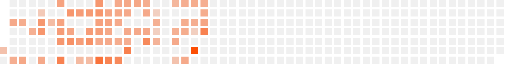

# Strava

Combine Strava API with 3rd party github-like activity chart implementation.

Served as a containerized app through GCP Cloud Run at: [https://strava.aniara.dev](https://strava.aniara.dev).

## Implementation References

- https://towardsdatascience.com/how-to-set-up-a-custom-domain-for-different-gcp-applications-using-a-load-balancer-bbcad40fed
- https://www.calhoun.io/securing-cookies-in-go/
